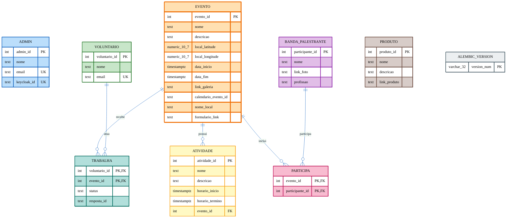

# Modelo Físico do Banco de Dados

## Introdução

O **Modelo Físico** representa a estrutura concreta do banco de dados, descrevendo de forma detalhada como as informações estão armazenadas no SGBD. Diferente do Modelo Conceitual (que apresenta entidades e relacionamentos de forma abstrata) e do Modelo Lógico (que define a estrutura independentemente do SGBD), o Modelo Físico contempla os tipos de dados específicos, restrições, chaves primárias, chaves estrangeiras, sequências, índices e demais elementos de implementação (HEUSER, 2009).

Este documento apresenta o modelo físico do banco de dados utilizado pela plataforma **IDB Jovem & Teen**, implementado em **PostgreSQL 15.18**. O modelo foi gerado a partir do dump da base de dados de produção (`dump_20260526_232450.sql`) e tem por objetivo documentar a estrutura atual de persistência da aplicação.

---

## Metodologia

A construção do modelo físico foi realizada a partir da análise do dump SQL exportado via `pg_dump`, contemplando:

1. Identificação das tabelas, suas colunas e tipos de dados.
2. Mapeamento das restrições de integridade (PRIMARY KEY, FOREIGN KEY, UNIQUE, NOT NULL).
3. Identificação das sequências (`SERIAL`) utilizadas para geração de identificadores.
4. Definição dos relacionamentos entre as entidades.
5. Documentação das extensões habilitadas no banco (`pg_trgm`).

---

## Visão Geral

O banco de dados é composto por **9 tabelas**, sendo:

- **6 tabelas de entidade**: `admin`, `voluntario`, `evento`, `atividade`, `banda_palestrante`, `produto`.
- **2 tabelas associativas**: `participa` (evento × banda_palestrante) e `trabalha` (voluntario × evento).
- **1 tabela de controle de migração**: `alembic_version`.

A extensão **`pg_trgm`** está habilitada para suportar busca textual baseada em trigramas (similaridade de strings).

---

## Diagrama Relacional



---

## Detalhamento das Tabelas

### 1. `admin`

Armazena os usuários administradores da plataforma, integrados via Keycloak.

| Coluna        | Tipo      | Restrições                          |
|---------------|-----------|-------------------------------------|
| `admin_id`    | `integer` | **PK**, `NOT NULL`, sequência       |
| `nome`        | `text`    | `NOT NULL`                          |
| `email`       | `text`    | `NOT NULL`, **UNIQUE**              |
| `keycloak_id` | `text`    | `NOT NULL`, **UNIQUE**              |

**Sequência:** `admin_admin_id_seq`

---

### 2. `voluntario`

Armazena os voluntários cadastrados na plataforma.

| Coluna          | Tipo      | Restrições                    |
|-----------------|-----------|-------------------------------|
| `voluntario_id` | `integer` | **PK**, `NOT NULL`, sequência |
| `nome`          | `text`    | `NOT NULL`                    |
| `email`         | `text`    | `NOT NULL`, **UNIQUE**        |

**Sequência:** `voluntario_voluntario_id_seq`

---

### 3. `evento`

Armazena os eventos divulgados e organizados pela IDB Jovem & Teen.

| Coluna                 | Tipo                          | Restrições                    |
|------------------------|-------------------------------|-------------------------------|
| `evento_id`            | `integer`                     | **PK**, `NOT NULL`, sequência |
| `nome`                 | `text`                        | `NOT NULL`                    |
| `descricao`            | `text`                        | `NULL`                        |
| `local_latitude`       | `numeric(10,7)`               | `NULL`                        |
| `local_longitude`      | `numeric(10,7)`               | `NULL`                        |
| `data_inicio`          | `timestamp with time zone`    | `NOT NULL`                    |
| `data_fim`             | `timestamp with time zone`    | `NOT NULL`                    |
| `link_galeria`         | `text`                        | `NULL`                        |
| `calendario_evento_id` | `text`                        | `NULL`                        |
| `nome_local`           | `text`                        | `NULL`                        |
| `formulario_link`      | `text`                        | `NULL`                        |

**Sequência:** `evento_evento_id_seq`

---

### 4. `atividade`

Atividades que compõem a programação de um evento.

| Coluna             | Tipo                          | Restrições                                |
|--------------------|-------------------------------|-------------------------------------------|
| `atividade_id`     | `integer`                     | **PK**, `NOT NULL`, sequência             |
| `nome`             | `text`                        | `NOT NULL`                                |
| `descricao`        | `text`                        | `NULL`                                    |
| `horario_inicio`   | `timestamp with time zone`    | `NOT NULL`                                |
| `horario_termino`  | `timestamp with time zone`    | `NOT NULL`                                |
| `evento_id`        | `integer`                     | `NOT NULL`, **FK** → `evento(evento_id)`  |

**Sequência:** `atividade_atividade_id_seq`

---

### 5. `banda_palestrante`

Bandas e palestrantes que participam dos eventos.

| Coluna            | Tipo      | Restrições                    |
|-------------------|-----------|-------------------------------|
| `participante_id` | `integer` | **PK**, `NOT NULL`, sequência |
| `nome`            | `text`    | `NOT NULL`                    |
| `link_foto`       | `text`    | `NULL`                        |
| `profissao`       | `text`    | `NULL`                        |

**Sequência:** `banda_palestrante_participante_id_seq`

---

### 6. `produto`

Produtos divulgados pela plataforma.

| Coluna          | Tipo      | Restrições                    |
|-----------------|-----------|-------------------------------|
| `produto_id`    | `integer` | **PK**, `NOT NULL`, sequência |
| `nome`          | `text`    | `NOT NULL`                    |
| `descricao`     | `text`    | `NULL`                        |
| `link_produto`  | `text`    | `NULL`                        |

**Sequência:** `produto_produto_id_seq`

---

### 7. `participa` *(associativa)*

Relacionamento N:N entre `evento` e `banda_palestrante`.

| Coluna            | Tipo      | Restrições                                                  |
|-------------------|-----------|-------------------------------------------------------------|
| `evento_id`       | `integer` | **PK**, `NOT NULL`, **FK** → `evento(evento_id)`            |
| `participante_id` | `integer` | **PK**, `NOT NULL`, **FK** → `banda_palestrante(participante_id)` |

**Chave Primária Composta:** (`evento_id`, `participante_id`)

---

### 8. `trabalha` *(associativa)*

Relacionamento N:N entre `voluntario` e `evento`, com atributos próprios.

| Coluna          | Tipo      | Restrições                                                |
|-----------------|-----------|-----------------------------------------------------------|
| `voluntario_id` | `integer` | **PK**, `NOT NULL`, **FK** → `voluntario(voluntario_id)`  |
| `evento_id`     | `integer` | **PK**, `NOT NULL`, **FK** → `evento(evento_id)`          |
| `status`        | `text`    | `NOT NULL`                                                |
| `resposta_id`   | `text`    | `NULL`                                                    |

**Chave Primária Composta:** (`voluntario_id`, `evento_id`)

---

### 9. `alembic_version` *(controle)*

Tabela de controle de versões de migração do Alembic (SQLAlchemy).

| Coluna        | Tipo                  | Restrições         |
|---------------|-----------------------|--------------------|
| `version_num` | `character varying(32)` | **PK**, `NOT NULL` |

---

## Restrições de Integridade

### Chaves Primárias

| Tabela              | Chave Primária                            |
|---------------------|-------------------------------------------|
| `admin`             | `admin_id`                                |
| `alembic_version`   | `version_num`                             |
| `atividade`         | `atividade_id`                            |
| `banda_palestrante` | `participante_id`                         |
| `evento`            | `evento_id`                               |
| `participa`         | (`evento_id`, `participante_id`)          |
| `produto`           | `produto_id`                              |
| `trabalha`          | (`voluntario_id`, `evento_id`)            |
| `voluntario`        | `voluntario_id`                           |

### Restrições UNIQUE

| Tabela       | Coluna(s)     |
|--------------|---------------|
| `admin`      | `email`       |
| `admin`      | `keycloak_id` |
| `voluntario` | `email`       |

### Chaves Estrangeiras

| Constraint                          | Origem                            | Destino                                |
|-------------------------------------|-----------------------------------|----------------------------------------|
| `atividade_evento_id_fkey`          | `atividade.evento_id`             | `evento(evento_id)`                    |
| `participa_evento_id_fkey`          | `participa.evento_id`             | `evento(evento_id)`                    |
| `participa_participante_id_fkey`    | `participa.participante_id`       | `banda_palestrante(participante_id)`   |
| `trabalha_evento_id_fkey`           | `trabalha.evento_id`              | `evento(evento_id)`                    |
| `trabalha_voluntario_id_fkey`       | `trabalha.voluntario_id`          | `voluntario(voluntario_id)`            |

---

## Relacionamentos (Cardinalidade)

| Relacionamento                            | Cardinalidade | Tabela Associativa |
|-------------------------------------------|---------------|--------------------|
| `evento` ↔ `atividade`                    | 1 : N         | —                  |
| `evento` ↔ `banda_palestrante`            | N : N         | `participa`        |
| `evento` ↔ `voluntario`                   | N : N         | `trabalha`         |

---

## Extensões Habilitadas

| Extensão  | Finalidade                                                       |
|-----------|------------------------------------------------------------------|
| `pg_trgm` | Mensuração de similaridade textual e indexação baseada em trigramas. Utilizada para busca aproximada (fuzzy search) em campos textuais como nomes de eventos, atividades e participantes. |

---

## Script DDL (Resumo)

```sql
CREATE EXTENSION IF NOT EXISTS pg_trgm WITH SCHEMA public;

CREATE TABLE public.admin (
    admin_id    integer NOT NULL,
    nome        text    NOT NULL,
    email       text    NOT NULL,
    keycloak_id text    NOT NULL,
    CONSTRAINT admin_pkey         PRIMARY KEY (admin_id),
    CONSTRAINT admin_email_key    UNIQUE      (email),
    CONSTRAINT admin_keycloak_id_key UNIQUE   (keycloak_id)
);

CREATE TABLE public.voluntario (
    voluntario_id integer NOT NULL,
    nome          text    NOT NULL,
    email         text    NOT NULL,
    CONSTRAINT voluntario_pkey      PRIMARY KEY (voluntario_id),
    CONSTRAINT voluntario_email_key UNIQUE      (email)
);

CREATE TABLE public.evento (
    evento_id            integer                  NOT NULL,
    nome                 text                     NOT NULL,
    descricao            text,
    local_latitude       numeric(10,7),
    local_longitude      numeric(10,7),
    data_inicio          timestamp with time zone NOT NULL,
    data_fim             timestamp with time zone NOT NULL,
    link_galeria         text,
    calendario_evento_id text,
    nome_local           text,
    formulario_link      text,
    CONSTRAINT evento_pkey PRIMARY KEY (evento_id)
);

CREATE TABLE public.atividade (
    atividade_id    integer                  NOT NULL,
    nome            text                     NOT NULL,
    descricao       text,
    horario_inicio  timestamp with time zone NOT NULL,
    horario_termino timestamp with time zone NOT NULL,
    evento_id       integer                  NOT NULL,
    CONSTRAINT atividade_pkey          PRIMARY KEY (atividade_id),
    CONSTRAINT atividade_evento_id_fkey FOREIGN KEY (evento_id)
        REFERENCES public.evento(evento_id)
);

CREATE TABLE public.banda_palestrante (
    participante_id integer NOT NULL,
    nome            text    NOT NULL,
    link_foto       text,
    profissao       text,
    CONSTRAINT banda_palestrante_pkey PRIMARY KEY (participante_id)
);

CREATE TABLE public.produto (
    produto_id   integer NOT NULL,
    nome         text    NOT NULL,
    descricao    text,
    link_produto text,
    CONSTRAINT produto_pkey PRIMARY KEY (produto_id)
);

CREATE TABLE public.participa (
    evento_id       integer NOT NULL,
    participante_id integer NOT NULL,
    CONSTRAINT participa_pkey PRIMARY KEY (evento_id, participante_id),
    CONSTRAINT participa_evento_id_fkey       FOREIGN KEY (evento_id)
        REFERENCES public.evento(evento_id),
    CONSTRAINT participa_participante_id_fkey FOREIGN KEY (participante_id)
        REFERENCES public.banda_palestrante(participante_id)
);

CREATE TABLE public.trabalha (
    voluntario_id integer NOT NULL,
    evento_id     integer NOT NULL,
    status        text    NOT NULL,
    resposta_id   text,
    CONSTRAINT trabalha_pkey               PRIMARY KEY (voluntario_id, evento_id),
    CONSTRAINT trabalha_voluntario_id_fkey FOREIGN KEY (voluntario_id)
        REFERENCES public.voluntario(voluntario_id),
    CONSTRAINT trabalha_evento_id_fkey     FOREIGN KEY (evento_id)
        REFERENCES public.evento(evento_id)
);

CREATE TABLE public.alembic_version (
    version_num character varying(32) NOT NULL,
    CONSTRAINT alembic_version_pkc PRIMARY KEY (version_num)
);
```

---

## Referências

* HEUSER, Carlos Alberto. *Projeto de Banco de Dados*. 6. ed. Porto Alegre: Bookman, 2009.
* ELMASRI, Ramez; NAVATHE, Shamkant B. *Sistemas de Banco de Dados*. 7. ed. São Paulo: Pearson, 2018.
* The PostgreSQL Global Development Group. **PostgreSQL 15 Documentation**. Disponível em: <https://www.postgresql.org/docs/15/>.

---

## Histórico de Versão

| Versão | Data       | Descrição                                              | Autor(es)                                              | Revisor(es) |
|--------|------------|--------------------------------------------------------|--------------------------------------------------------|-------------|
| `0.1`  | 26/05/2026 | Criação do modelo físico a partir do dump PostgreSQL.  | [Victor Pontual](https://github.com/VictorPontual)     | —           |
